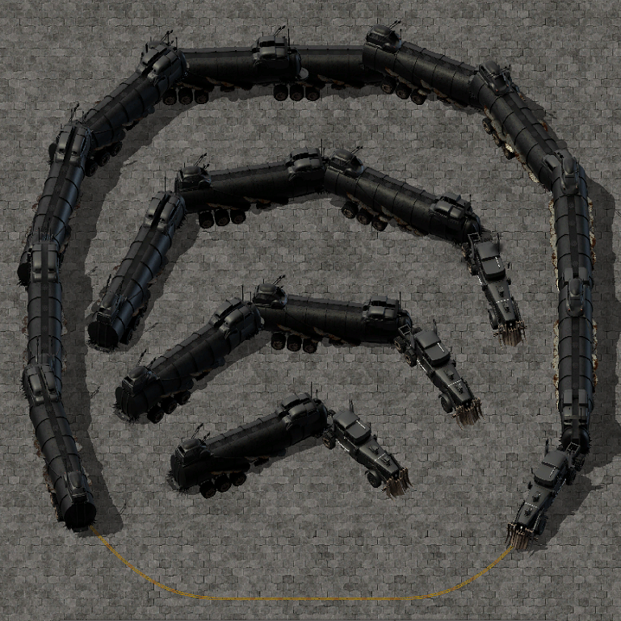

# War Rig Transport

War Rig Transport adds large War Rig-style road trailers and rail vehicles to Factorio 2.0.

The road variants are freely drivable like normal cars, while their trailers follow using scripted articulation. The rail variants use Factorio's standard train system and can run on both vanilla rails and the included road-styled rails.

## Features

### Road Trailers

- **Semi-Trailer** — tractor + 1 cargo trailer
- **Double-Trailer** — tractor + 2 cargo trailers
- **Triple-Trailer** — tractor + 3 cargo trailers
- Each trailer has a **100-slot cargo inventory**
- Trailer inventories can be accessed by players and loaded or unloaded with inserters
- Double and Triple variants articulate independently between trailer segments

Placing a road vehicle automatically creates the required trailer segments. The trailers are managed as part of the same logical vehicle and do not need to be crafted or coupled separately.

### Rail Transport

- **Rail War Rig** — locomotive using normal locomotive fuel
- **Rail Cargo Trailer** — 100-slot cargo wagon
- **Rail Fluid Trailer** — 50,000 fluid capacity
- **Road rails** — road-styled rails matching the War Rig aesthetic

Rail vehicles use Factorio's normal train mechanics, including stations, schedules, signals, inserters, and pumps. They are compatible with both vanilla rails and the included Road rails.

## Requirements

- Factorio 2.0
- Mod ID: `War_Rig_Transport`
- Dependency: `base >= 2.0`

## Research

| Technology | Prerequisites | Cost | Unlocks |
| --- | --- | --- | --- |
| Semi-Trailer | Automobilism | Automation + Logistic ×100 | Semi-Trailer |
| Double-Trailer | Semi-Trailer | Automation + Logistic ×200 | Double-Trailer |
| Triple-Trailer | Double-Trailer | Automation + Logistic ×300 | Triple-Trailer |
| Rail War Rig | Automated Rail Transportation + Fluid Wagon | Automation + Logistic ×250 | Rail War Rig, Cargo Trailer, Fluid Trailer, Road rails |

## Known Limitations

- Road trailers are not native physically coupled vehicles; their articulation is script-controlled.
- Native vehicle behavior such as impact damage, tree destruction, and vehicle-to-vehicle collision is not reproduced perfectly by the scripted trailer system.
- Trailer entity weight does not automatically contribute to the tractor's native `car` mass, so the Semi, Double, and Triple variants use different tractor weights to approximate heavier combinations.
- Road rails are visual variants of normal rails. Rail War Rig vehicles are not restricted to them.

## Technical Details

Implementation details, prototype names, tuning constants, runtime storage layout, trailer kinematics, collision handling, removal behavior, and required in-game regression tests are documented in [SPEC.md](SPEC.md).

## License and Credits

War Rig Transport is licensed under **[CC BY-NC-SA 4.0](LICENSE)**.

Vehicle graphics, icons, sounds, minimap assets, and road-rail artwork are derived from or redistributed from TheKingJo's Factorio mods:

- **King Jo's War Rig Truck** (`kj_warrig`)
- **King Jo's Vehicles** (`kj_vehicles`)

The upstream material is also distributed under **CC BY-NC-SA 4.0**. Detailed attribution and the list of reused files are documented in [THIRD_PARTY_LICENSES.md](THIRD_PARTY_LICENSES.md).

War Rig Transport is an independent derivative project and is not endorsed by the original mod authors.
